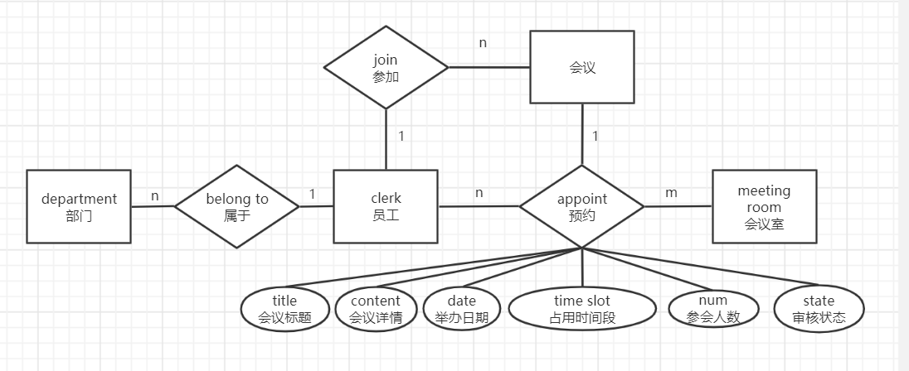
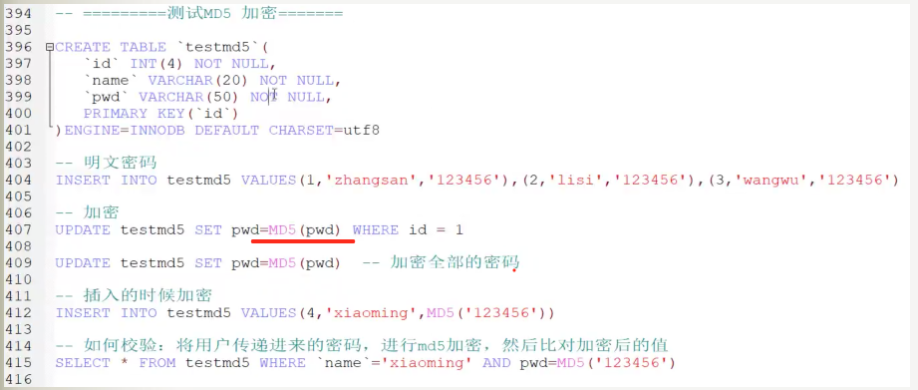

# meeting-server
练手项目：会议管理系统的服务器部分，由springboot+mybatis+mysql搭建 

## 1.数据库设计工作

### 数据库设计

#### E-R图

#### 数据库设计

department(id,department_name)

clerk(id,department_id,name)

meeting_message(id,room_id,host_clerk_id，title,content,date,time_slot,record,check_state)

room(id,room_address,num,is_available,appoint_num)

join(id,clerk_join_id,meeting_message_id)

user(id,username,password,power,clerk_id)

#### 数据库表

##### 1.department 部门表

department(id,department_name)

| 属性            | 类型        | 约束                       | 解释   |
| --------------- | ----------- | -------------------------- | ------ |
| id              | INT(4)      | PK,NOT NULL AUTO_INCREMENT | 主键   |
| department_name | VARCHAR(20) | NOT NULL                   | 部门名 |

##### 2.room 会议室表

room(id,room_address,is_available,appoint_num)

| 属性         | 类型                     | 约束                       | 解释         |
| ------------ | ------------------------ | -------------------------- | ------------ |
| id           | INT(4)                   | PK,NOT NULL AUTO_INCREMENT | 主键         |
| room_address | VARCHAR(20)              | NOT NULL                   | 会议室门牌号 |
| is_available | ENUM('enable','disable') | NOT NULL DEFAULT 'enable'  | 是否可用     |
| appoint_num  | INT(4)                   | NOT NULL DEFAULT 0         | 预约人数     |

##### 3.meeting_message 会议信息表

meeting_message(id,room_id,host_clerk_id，title,content,date,time_slot,record,check_state)

| 属性          | 类型                                                                                                                 | 约束                           | 解释                             |
| :------------ | -------------------------------------------------------------------------------------------------------------------- | ------------------------------ | -------------------------------- |
| id            | INT(4)                                                                                                               | PK,NOT NULL AUTO_INCREMENT     | 主键                             |
| room id       | INT(4)                                                                                                               | FK(room.id),NOT NULL           | 外键（room.id）,该会议对应会议室 |
| host_clerk_id | INT(4)                                                                                                               | FK(clerk.id),NOT NULL          | 外键(clerk.id)该会议主办人id     |
| title         | VARCHAR(20)                                                                                                          | NOT NULL                       | 会议标题                         |
| content       | VARCHAR(100)                                                                                                         | NOT NULL DEFAULT '无'          | 会议内容                         |
| date          | DATE                                                                                                                 | NOT NULL                       | 会议日期                         |
| time_slot     | ENUM('9:00-10:00','10:00-11:00','11:00-12:00','12:00-13:00','15:00-16:00','16:00-17:00','17:00-18:00','18:00-19:00') | NOT NULL  DEFAULT '9:00-10:00' | 会议时间，只能从8个时间段中选择  |
| record        | VARCHER(100)                                                                                                         | NOT NULL DEFAULT '无'          | 会议纪要                         |
| check_state   | ENUM('已审核通过','已审核未通过','未审核')                                                                           | NOT NULL DEFAULT '未审核'      | 会议审核情况，默认为未审核       |
| time_state    | ENUM('未开始','进行中','已完成')                                                                                     | NOT NULL DEFAULT '未开始'      | 会议时间状态，默认为未开始       |

##### 4.join 参会信息表

join(id,meeting_message_id,clerk_join_id)

| 属性               | 类型   | 约束                       | 解释                             |
| ------------------ | ------ | -------------------------- | -------------------------------- |
| id                 | INT(4) | PK,NOT NULL AUTO_INCREMENT | 主键                             |
| meeting_message_id | INT(4) | FK,NOT NULL                | 外键，代表词条记录对应的会议     |
| clerk_join_id      | INT(4) | FK,NOT NULL                | 外键，代表会议记录对应的参会人员 |

##### 5.clerk 职员表

clerk(id,department_id,name)

| 属性          | 类型        | 约束                       | 解释                       |
| ------------- | ----------- | -------------------------- | -------------------------- |
| id            | INT(4)      | PK,NOT NULL AUTO_INCREMENT | 主键                       |
| department_id | INT(4)      | FK(department.id),NOT NULL | 部门号，标识该职员所属部门 |
| name          | VARCHAR(20) | NOT NULL                   | 姓名                       |

##### 6.user 用户表

user(id,username,password,power,clerk_id)

| 属性     | 类型                | 约束                       | 解释                   |
| -------- | ------------------- | -------------------------- | ---------------------- |
| id       | INT(4)              | PK,NOT NULL AUTO_INCREMENT | 主键                   |
| clerk id | INT(4)              | FK(clerk.id),NOT NULL      | 职员号，该用户对应职员 |
| username | VARCHAR(20)         | NOT NULL                   | 用户名                 |
| password | VARCHAR(20)         | NOT NULL DEFAULT '666666'  | 密码                   |
| power    | ENUM('admin','ord') | NOT NULL DEFAULT 'ord'     | 权限，默认为普通用户   |

#### 密码加密

